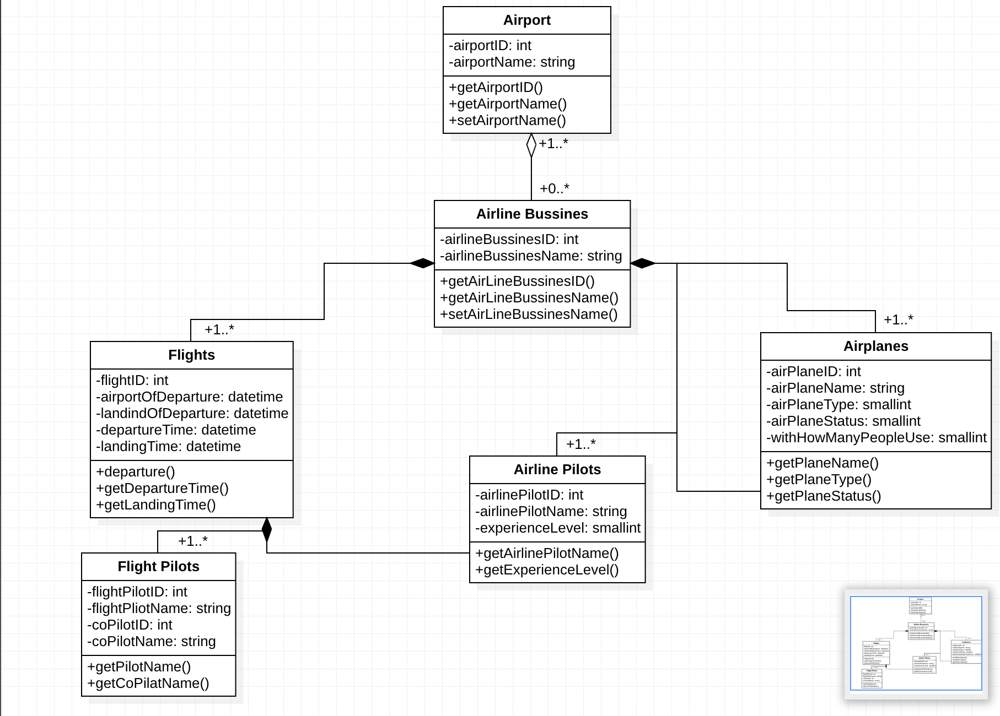

# Flight-Management-System

[Patika.dev](https://www.patika.dev/tr)

Uçuş Yönetim Sistemininin belirtilen kriterlece UML gösteriminin yapıldığı projedir.

---

Uçuş yönetim sistemi projesine dair bizlerden istenen özellikler aşağıdaki şekildedir.

```
Uçuşların ve pilotların yönetimi için bir sistem tasarlayın.

- Hava yolu şirketleri uçuşları gerçekleştirir. Her hava yolunun bir kimliği vardır.
- Hava yolu şirketi, farklı tipteki uçaklara sahiptir.
- Uçaklar çalışır veya onarım durumunda olabilir.
- Her uçuşun benzersiz kimliği, kalkacağı ve ineceği havaalanı, kalkış ve iniş saatleri vardır.
- Her uçuşun bir pilotu ve yardımcı pilotu vardır ve uçağı kullanırlar.
- Havaalanlarının benzersiz kimlikleri ve isimleri vardır.
- Hava yolu şirketlerinin pilotları vardır ve her pilotun bir deneyim seviyesi mevcuttur.
- Bir uçak tipi, belirli sayıda pilota ihtiyaç duyabilir.
- Bu sistemi tasvir eden Class(Sınıf) diyagramını çiziniz.

```

---

Yukarıda ki, istenen özelliklere göre Uçuş-Yönetim-Sistemi için tasarlanan UML-Design aşağıdaki gibidir.



Görselin altında bu design'a ait açıklamalar yer almaktadır.

1. Havaalanları hava şirketleri ve bu şirketlerin uçaklarına ev sahipliği yaptığından bu projede
olması zorunlu olan Class'lardan bir tanesidir. Bundan dolayı 1..* ibaresi eklenmiştir.

2. Bir havaalanına bağlı hiç bir şirketin olmaması gibi durumlarında yaşanabileceği senaryolar için
kendisine Aggregation şeklinde bağlı olan bir ilişki türü, bir class (Airline Bussines) mevcuttur.

3. Eğer Airline Bussines, yani bir havayolu şirketi oluşturulmuşsa, mantıken bu şirkete bağlı olarak
Uçaklar, Uçuş Rotaları, Pilotlar zorunlu oluşacağından bu class'ların (Flights, Flight Pilots, Airplanes)
ilişkisi Composition şeklinde oluşturulmuştur.

4. Bunun haricinde classlar arasında ki diğer ilişki türleri, Assocation şeklinde belirtilmiştir.
Flight Pilots ile Airline Pilots, Airline Pilots ile Airline Class'ları arasında ki ilişki gösterilmeye çalışılmıştır.